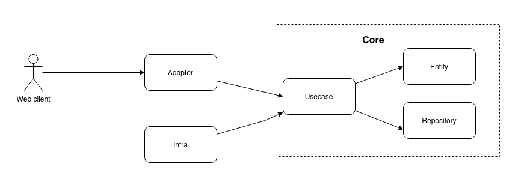

# QuikDev back-end challenge


## Arquitetura:

Este projeto foi desenvolvido com o design da clean arch, pois é de grande valia a flexibilidade e baixo acoplamento que a arquitetura oferece.
A ideia conforme imagem abaixo, permite que as camadas mais internas do software estejam  `blindadas` de ferramentas e outros detalhes de implamentação
favorecendo a extensão do software seja por meio dos custos ou a manutenção do mesmo.



 - Adapter - camada que facilita o desacoplamento entre as camadas de mais baixo nível
 e permite o reuso do core business.

 - Core - parte principal que representa a essencia do negócio. A ideia aqui é 
 que essa camada possa responder a qualquer tipo de solicitação independente
 da tecnologia cliente externa. Composta por `entity` que engloba as `regras` de
 negócio, `repository` que é uma abstração de onde os dados serão persistidos e 
 `usecase` que é o cordenador de fluxo das funcionalidades de uma operação de 
 valor dentro do negócio.
 A principal vantagem é que não importa a tecnologia ou ferramenta utilizada nas 
 camadas acima do core, ele sempre responderá e manterá a consistência com as 
 regras do negócio.

 - Infra - camada externa que implementa as abstrações do domínio e relacionadas
 a stacks, ferramentas, etc... totalmente externos ao core da aplicação.

 `db` é um utilitário para configurar o pool de conexões com o `Postgres`. Ele controla
 as migrations do banco de dados e cria um pool de conexões.

 
## Stack utilizada: 

- NodeJS v18.20.2
- Yarn 1.22.22
- Banco de Dados Postgres v15.6
- Docker version 24.0.5, build 24.0.5-0ubuntu1
- Docker Compose version 2.20.2+ds1-0ubuntu1
- Express 
- Jest
- Cors
- Dotenv
- Body-parser
- Bcrypt
- Jsonwebtoken
- PG

Utilizei a versão 18 do nodeJS pois é a mais recente que tenho utlizado ultimamente.
Para webserver escolhi o framework Express, pois é bem fácil de utilizar, tem bastante documentação disponível 
na web, além de ser simples e possuir uma série pacotes que agilizam o desenvolvimento. 

Quanto ao banco de dados optei por utilizar um banco relacional pela natureza tabular dos dados, ter um schema bem definido e
possibilidade do SQL resolver bem as demandas solicitadas nesse dessafio. Para avaliar um banco NoSQL, eu precisaria de mais
detalhes ou avaliações de arquitetura relacionada ao negócio para optar por tal escolha. 
O banco utilizado foi o Postgres, pois trabalho com o mesmo a muito tempo, é bem utilizado no mercado e tem serviço gerenciado
em muitos provedores de serviços de cloud como AWS, GCP etc...

O docker e docker compose foram utilizados para executar uma instancia do Postgres localmente.

As demais libs são bem conhecidas no mercado, mas utilizo o jest para executar os testes unitários, o CORS para evitar o erro de requisições entre 
domínios e/ou protocolos http e https diferentes. 
O dotenv utilizo para carregar as variáveis de ambiente do projeto, o body-parser para manipular os dados enviados via post e o multer para manipular os dados enviados via upload.
O bcrypt para criptografar as senhas, o jsonwebtoken para gerar os tokens de autenticação e o pg para realizar as operações no banco de dados.


### Como executar localmente.

- Você precisa ter o nodeJS 18.20.2 instalado, e o docker e docker compose instalados.

- Na raiz do projeto crie um arquivo `.env` com o conteúdo do arquivo `.env.example`
Modifique os valores de senhas e etc... Por questão de segurança eu não subi o arquivo `.env` para o git pois não é uma boa prática.
<b>Atenção</b>: para gerar o valor da env `SECRET_KEY` utilize o comando abaixo no seu terminal: 

```
node -e "console.log(require('crypto').randomBytes(256).toString('base64'));"
```
Copie o valor gerado e cole no arquivo `.env` conforme descrito anteriormente.

- Execute os comandos abaixo na raiz do projeto:

```
docker-compose up -d
```

Este comando irá configurar o seu banco de dados Postgres localmente. Observe que ele utiliza o script de inicialização `initdb.sh` para
configurar o banco de dados a primeira vez.

Crie o projeto com o yarn:

```
yarn init
```

Depois de finalizar a criação do projeto, acessa o diretorio criado e instale as libs com:


```
yarn add --dev jest
yarn add express
yarn add cors
yarn add dotenv
yarn add body-parser
yarn add bcrypt
yarn add jsonwebtoken
yarn add multer
yarn add pg

```

Após instalar essas libs, execute os testes unitários do projeto com:

```
yarn run test
```

Com o banco de dados `up` via docker compose, execute a api: 

```
yarn run express
```
  
Infelizmente não foi possível finalizar toda a demanda descrita neste projeto por questão do tempo, mas para
executar os endpoints exportados via postman do diretório `docs/examples/postmant` execute o script `load.sh` de carga
do banco de dados em `scripts`. Para isso, na raiz do projeto execute o comando:

```
docker-compose up -d
```

Este comando irá configurar o seu banco de dados Postgres localmente. Observe que ele utiliza o script de inicialização `initdb.sh` para
configurar o banco de dados a primeira vez.

Após executar o script, execute o script `load.sh` de carga do banco de dados em `scripts`.


```
cat scripts/load.sh | docker exec -i db bash
```
Se o banco de dados estiver configurado corretamente, você deverá ver uma mensagem de insert concluída com sucesso e ao acessar o banco
de dados com o seu client pqsql verá na tabela `"user"` dois usuários inseridos. A senha dos usuários de teste é  `123456`

Feito isso, é só importar a collection no postman e executar os endpoints.


Eu consegui finalizar até o item `5d` e para visualizar as tabelas do banco de dados, execute o comando:

```
docker exec -it db /bin/bash
psql -U <seu_usuario> quikdev_app
```
  
Ou se preferir pode acessar via DBeaver  </br>
https://dbeaver.io/download/


Qualquer dúvida ou sugestão, entre em contato comigo: leolbsti@gmail.com

Obrigado.

